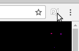
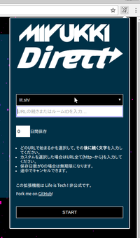
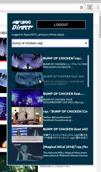
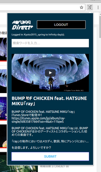

# MIYUKKI Direct
シンプルかつ高機能な DJ MIYUKKI SYSTEM の 非公式 Google Chrome 拡張機能のクライアント。

## Why MIYUKKI Direct?
このクライアントは以下の機能を備えています。

- [x] ツールバーからダイレクトに開く
- [x] 短縮URLからルームIDの取得
- [x] ルームIDの保存
- [x] ルームIDの有効期間の設定
- [x] YouTubeの動画の検索
- [x] 動画の再生
- [x] DJ MIYUKKI SYSTEM への動画の送信
- [x] 動画の送信履歴保存/表示/削除機能
- [x] ルームID、保存期間、送信履歴のGoogleアカウントを使用した同期
- [x] 動画検索時の入力サジェスト機能
- [x] 強力なキーボード操作のサポートにより、キーボードのみで快適な操作が可能

## インストール
以下のいずれかの方法でインストールできます。

- [chrome web store](https://chrome.google.com/webstore/detail/miyukki-direct/dlfogodhkanjnljickloiabigndaiema)からインストール (推奨)
- GitHubの[Release](https://github.com/lit-kansai-members/MIYUKKI-Direct/releases)から`*.crx`ファイルをダウンロードし、拡張機能設定(`chrome://extensions`)にドラッグアンドドロップ

## 使い方
ブラウザ右上のツールバーにある「DJ」と書かれたアイコンをクリックするか、<kbd><kbd>Alt</kbd>+<kbd>Shift</kbd>+<kbd>M</kbd></kbd>でポップアップが表示されます。

### 初期設定画面

初回起動時または保存期間が過ぎると、ポップアップの表示時にログイン画面が出てきます。

- URLの種類
- 短縮URLかルームID
- ルームIDの保存期間（次回からこの期間の間はルームIDの入力が省略できます）

を入力し、「START」を押してください。

### 検索

送信画面、エラー画面、完了画面にて、検索ボックスにフォーカスをあてるか、<kbd>S</kbd>キーを押すと、検索画面へ移動します。

検索ボックスに文字を入力すると、YouTubeの動画を検索します。  
検索結果をクリックすると、送信画面に移動します。

また、検索ボックスに何も入力していない状況では送信履歴が表示されます。  
これも同じように送信することが可能です。  
この履歴は、ルームIDの保存期間が終了しても残ります。

### 送信画面

検索画面や送信履歴をクリックした場合や、YouTubeの送信可能な動画上でポップアップを表示すると、この画面が表示されます。

「SUBMIT」ボタンを押すと、DJ MIYUKKI SYSTEM に動画を送信します。  
その結果によってエラー画面か完了画面かが表示されます。

また、この画面で動画を再生することも可能です。  
その場合は、<kbd>スペース</kbd>で再生/停止、<kbd>↑</kbd>、<kbd>↓</kbd>で音量調節など、YouTubeのショートカットキーが使用可能です。
